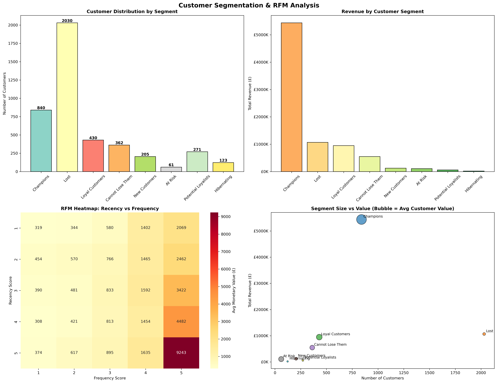
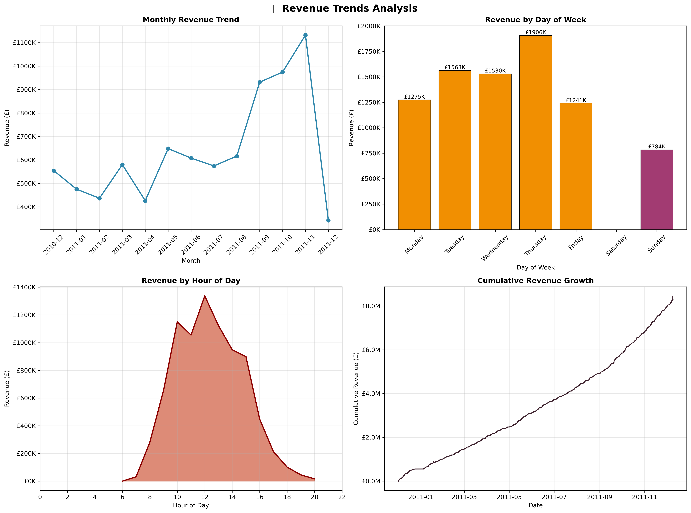
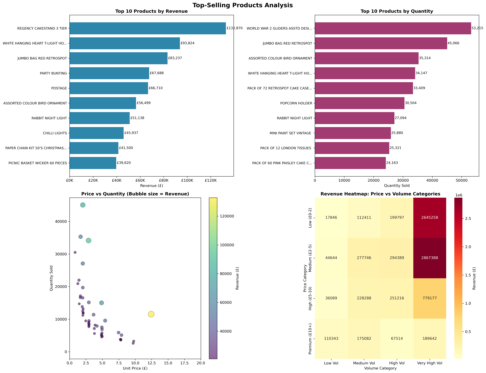
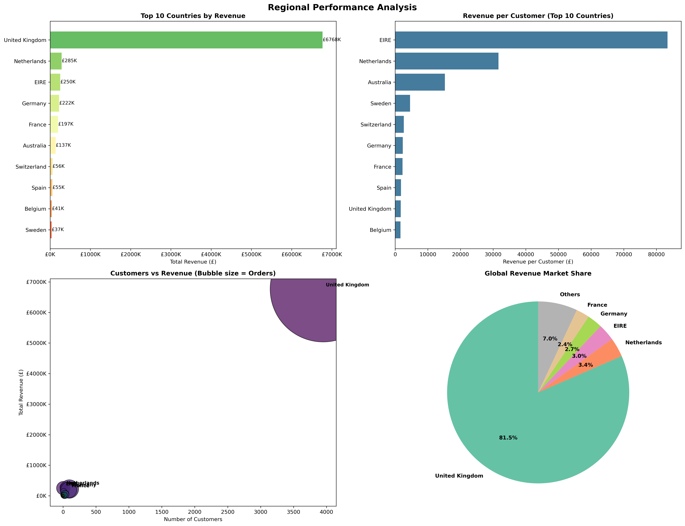

#  Business Sales Performance Analysis

**Author:** [Mojalefa-04](https://github.com/Mojalefa-04)  
**Created:** March 2026


A comprehensive analysis of business sales data covering revenue trends, product performance, category insights, regional distribution, and customer segmentation. This repository contains Python-generated visualizations and a Tableau dashboard for interactive exploration.

---

##  Project Overview

This project analyzes sales performance data from December 2010 to December 2011, providing actionable insights across multiple business dimensions:

| Metric | Value |
|--------|-------|
| **Total Revenue** | £8.3M+ |
| **Total Customers** | 4,322 |
| **Peak Revenue Month** | November 2011 (£1.13M) |
| **Top Market** | United Kingdom (81.5%) |

---

## 📈 Dashboard & Visualizations

### Tableau Dashboard
The main interactive dashboard includes:
- **Revenue Trend Analysis** - Monthly, daily, and hourly patterns
- **Top-Selling Products** - Revenue and quantity leaders
- **Category Analysis** - Performance across product categories
- **Regional Performance** - Geographic distribution and metrics

&gt; 🔗 *[[Tableau Dashboard](https://public.tableau.com/views/SalesPerfomanceDashboard_17743468240840/SalesPerformaceDashboard?:language=en-US&publish=yes&:sid=&:redirect=auth&:display_count=n&:origin=viz_share_link)]*

---

## 👥 Customer Segmentation & RFM Analysis



### Key Customer Insights

| Segment | Customers | Revenue | Avg Customer Value | Strategy |
|---------|-----------|---------|-------------------|----------|
| **Champions**  | 840 (19.4%) | £5,437,880 (65.4%) | £6,474 | Reward & retain |
| **Lost**  | 2,030 (47.0%) | £1,055,000 (12.7%) | £520 | Win-back campaigns |
| **Loyal Customers**  | 430 (10.0%) | £937,000 (11.3%) | £2,179 | Upsell opportunities |
| **Cannot Lose Them**  | 362 (8.4%) | £522,000 (6.3%) | £1,442 | Immediate attention |
| **New Customers**  | 205 (4.7%) | £124,000 (1.5%) | £605 | Onboarding & nurture |
| **At Risk**  | 61 (1.4%) | £89,000 (1.1%) | £1,459 | **URGENT: Retention required** |
| **Potential Loyalists**  | 271 (6.3%) | £87,000 (1.0%) | £321 | Engagement programs |
| **Hibernating**  | 123 (2.8%) | £52,000 (0.6%) | £423 | Reactivation campaigns |

### RFM Analysis Heatmap

The RFM (Recency, Frequency, Monetary) heatmap reveals:
- **High-value customers** (Frequency 5, Recency 5): £9,243 average monetary value
- **At-risk high spenders** show declining recency but high historical value
- **Frequency correlation**: Higher purchase frequency strongly correlates with increased customer lifetime value

### 🚨 Critical Alert: At-Risk Customers

**61 customers** are flagged as "At Risk" — these customers previously showed good engagement but haven't purchased recently. Immediate intervention recommended to prevent churn.

---

##  Supporting Analysis Charts

<details>
<summary><b> Revenue Trends Analysis</b></summary>



**Key Insights:**
- **Peak Month**: November 2011 (£1,132,407.74) — Holiday shopping surge
- **Best Day**: Thursday (£1,906,108.19) — Mid-week peak performance
- **Peak Hour**: 12:00 PM (£1,337,091.77) — Lunch-time shopping spike
- **Seasonality**: Strong Q4 performance with December drop-off (likely data cutoff)
</details>

<details>
<summary><b> Top-Selling Products</b></summary>



**Top 5 by Revenue:**
| Rank | Product | Revenue |
|------|---------|---------|
| 1 | REGENCY CAKESTAND 3 TIER | £132,870.40 |
| 2 | WHITE HANGING HEART T-LIGHT HOLDER | £93,823.85 |
| 3 | JUMBO BAG RED RETROSPOT | £83,236.76 |
| 4 | PARTY BUNTING | £67,687.53 |
| 5 | POSTAGE | £66,710.24 |

**Top 5 by Volume:**
| Rank | Product | Units Sold |
|------|---------|------------|
| 1 | WORLD WAR 2 GLIDERS ASSTD DESIGNS | 53,215 |
| 2 | JUMBO BAG RED RETROSPOT | 45,066 |
| 3 | ASSORTED COLOUR BIRD ORNAMENT | 35,314 |
| 4 | WHITE HANGING HEART T-LIGHT HOLDER | 34,147 |
| 5 | PACK OF 72 RETROSPOT CAKE CASES | 33,409 |
</details>

<details>
<summary><b> Category Analysis</b></summary>


**Key Insights:**
- **Top Revenue Category**: Other (£2,465,318.63) — 29.7% market share
- **Highest Avg Transaction**: Frames & Decor (£30.58)
- **Volume Leader**: Other category (1,464,192 units)
- **Price-Volume Matrix**: Low-price/High-volume products drive majority of revenue
</details>

<details>
<summary><b> Regional Performance</b></summary>



**Key Insights:**
- **Dominant Market**: United Kingdom (£6,767,873.39, 81.5% of total revenue)
- **Highest Revenue per Customer**: EIRE (£83,428.41)
- **Most Active Customers**: EIRE (106.3 orders per customer)
- **Top International Markets**: Netherlands (£285K), EIRE (£250K), Germany (£222K)
</details>

---

## 🛠️ Technical Stack

| Component | Technology |
|-----------|------------|
| **Data Processing** | Python (Pandas, NumPy) |
| **Visualization** | Matplotlib, Seaborn |
| **Dashboard** | Tableau |
| **Data Source** | [Online Retail Dataset](https://www.kaggle.com/datasets/ulrikthygepedersen/online-retail-dataset) |

---
## 📧 Contact

For questions or collaboration:

- **GitHub:** [@Mojalefa-04](https://github.com/Mojalefa-04)
- **Email:** progresmokhathi@gmail.com
- **LinkedIn:** [Mojalefa Mokhathi](https://www.linkedin.com/in/mojalefa-mokhathi-81540224a)

---
##  Getting Started

### Prerequisites
```bash
pip install pandas numpy matplotlib seaborn jupyter
